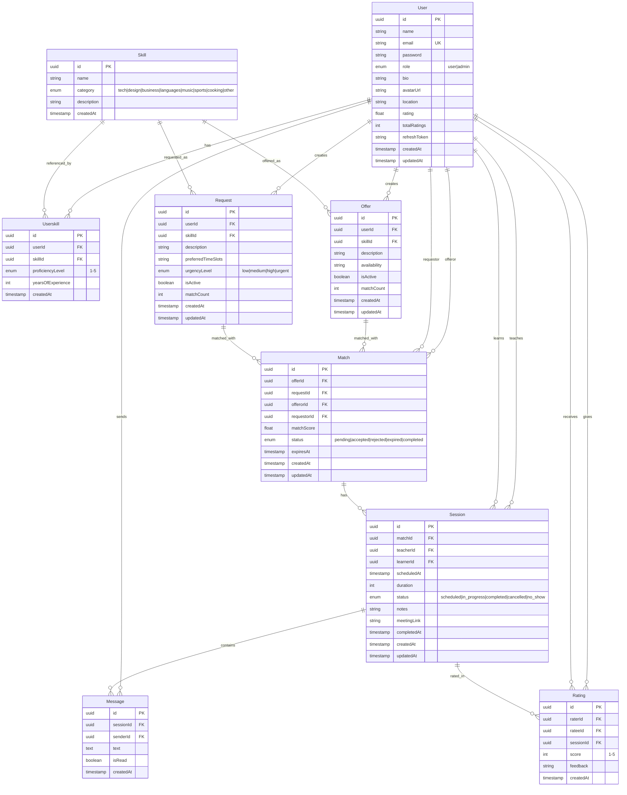

# Skill-Swap Platform - Database Schema

## Overview

This document provides a comprehensive view of the skill-swap platform's database schema, including all entities, relationships, and design decisions.

## Entity Relationship Diagram

## Entities

### Core Entities

#### User
Central entity representing platform users.

**Attributes:**
- `id` (UUID, PK) - Unique identifier
- `name` (string) - User's display name
- `email` (string, unique) - Authentication email
- `password` (string) - Hashed password
- `role` (enum) - User role: `user` | `admin`
- `bio` (string, nullable) - User biography
- `avatarUrl` (string, nullable) - Profile picture URL
- `location` (string, nullable) - User location
- `rating` (float) - Aggregated rating score
- `totalRatings` (int) - Total number of ratings received
- `refreshToken` (string, nullable) - JWT refresh token
- `createdAt` (timestamp) - Account creation date
- `updatedAt` (timestamp) - Last update date

**Relationships:**
- Has many `Userskill` (skills portfolio)
- Has many `Offer` (skills offered to teach)
- Has many `Request` (skills requested to learn)
- Has many `Match` as offeror
- Has many `Match` as requestor
- Has many `Session` as teacher
- Has many `Session` as learner
- Has many `Message` (sent messages)
- Has many `Rating` as rater
- Has many `Rating` as ratee

#### Skill
Master catalog of available skills.

**Attributes:**
- `id` (UUID, PK) - Unique identifier
- `name` (string) - Skill name
- `category` (enum) - Skill category: `tech` | `design` | `business` | `languages` | `music` | `sports` | `cooking` | `other`
- `description` (string, nullable) - Skill description
- `createdAt` (timestamp) - Creation date

**Relationships:**
- Has many `Userskill`
- Has many `Offer`
- Has many `Request`

#### Userskill
Junction table linking users to their skills with proficiency information.

**Attributes:**
- `id` (UUID, PK) - Unique identifier
- `userId` (UUID, FK) - Reference to User
- `skillId` (UUID, FK) - Reference to Skill
- `proficiencyLevel` (enum) - Skill level: `1` (Beginner) to `5` (Master)
- `yearsOfExperience` (int, nullable) - Years of experience
- `createdAt` (timestamp) - Creation date

**Constraints:**
- Unique constraint on `(userId, skillId)` - Prevents duplicate skill entries

**Relationships:**
- Belongs to `User`
- Belongs to `Skill`

### Marketplace Entities

#### Offer
Skills that users are offering to teach.

**Attributes:**
- `id` (UUID, PK) - Unique identifier
- `userId` (UUID, FK) - Reference to User
- `skillId` (UUID, FK) - Reference to Skill
- `description` (string) - Offer description
- `availability` (string, nullable) - Available time slots (e.g., "Mon, Wed, Fri 6pm-8pm")
- `isActive` (boolean) - Whether offer is active
- `matchCount` (int) - Denormalized count of matches
- `createdAt` (timestamp) - Creation date
- `updatedAt` (timestamp) - Last update date

**Relationships:**
- Belongs to `User`
- Belongs to `Skill`
- Has many `Match`

#### Request
Skills that users want to learn.

**Attributes:**
- `id` (UUID, PK) - Unique identifier
- `userId` (UUID, FK) - Reference to User
- `skillId` (UUID, FK) - Reference to Skill
- `description` (string) - Request description
- `preferredTimeSlots` (string, nullable) - Preferred time slots (e.g., "Mon, Tue 7pm-9pm")
- `urgencyLevel` (enum) - Urgency: `low` | `medium` | `high` | `urgent`
- `isActive` (boolean) - Whether request is active
- `matchCount` (int) - Denormalized count of matches
- `createdAt` (timestamp) - Creation date
- `updatedAt` (timestamp) - Last update date

**Relationships:**
- Belongs to `User`
- Belongs to `Skill`
- Has many `Match`

#### Match
Connects an offer with a request, creating a potential skill exchange.

**Attributes:**
- `id` (UUID, PK) - Unique identifier
- `offerId` (UUID, FK) - Reference to Offer
- `requestId` (UUID, FK) - Reference to Request
- `offerorId` (UUID, FK) - User who made the offer
- `requestorId` (UUID, FK) - User who made the request
- `matchScore` (float) - Algorithm-calculated match quality (0-100)
- `status` (enum) - Match status: `pending` | `accepted` | `rejected` | `expired` | `completed`
- `expiresAt` (timestamp, nullable) - Match expiration date
- `createdAt` (timestamp) - Creation date
- `updatedAt` (timestamp) - Last update date

**Relationships:**
- Belongs to `Offer`
- Belongs to `Request`
- Belongs to `User` (offeror)
- Belongs to `User` (requestor)
- Has many `Session`

### Session & Communication Entities

#### Session
Scheduled learning sessions between matched users.

**Attributes:**
- `id` (UUID, PK) - Unique identifier
- `matchId` (UUID, FK) - Reference to Match
- `teacherId` (UUID, FK) - User teaching (offeror)
- `learnerId` (UUID, FK) - User learning (requestor)
- `scheduledAt` (timestamp) - Session start time
- `duration` (int) - Duration in minutes (default: 60)
- `status` (enum) - Session status: `scheduled` | `in_progress` | `completed` | `cancelled` | `no_show`
- `notes` (string, nullable) - Session notes
- `meetingLink` (string, nullable) - Video call link (Zoom, Google Meet, etc.)
- `completedAt` (timestamp, nullable) - Completion timestamp
- `createdAt` (timestamp) - Creation date
- `updatedAt` (timestamp) - Last update date

**Relationships:**
- Belongs to `Match`
- Belongs to `User` (teacher)
- Belongs to `User` (learner)
- Has many `Message`
- Has many `Rating`

#### Message
Chat messages within a session.

**Attributes:**
- `id` (UUID, PK) - Unique identifier
- `sessionId` (UUID, FK) - Reference to Session
- `senderId` (UUID, FK) - Reference to User (sender)
- `text` (text) - Message content
- `isRead` (boolean) - Read status
- `createdAt` (timestamp) - Creation date

**Relationships:**
- Belongs to `Session`
- Belongs to `User` (sender)

#### Rating
Post-session feedback and rating system.

**Attributes:**
- `id` (UUID, PK) - Unique identifier
- `raterId` (UUID, FK) - User giving the rating
- `rateeId` (UUID, FK) - User receiving the rating
- `sessionId` (UUID, FK, nullable) - Optional reference to Session
- `score` (int) - Rating score (1-5 stars)
- `feedback` (string, nullable) - Written feedback
- `createdAt` (timestamp) - Creation date

**Constraints:**
- Unique constraint on `(sessionId, raterId)` - One rating per session per user

**Relationships:**
- Belongs to `User` (rater)
- Belongs to `User` (ratee)
- Belongs to `Session` (optional)

## Database Indexes

Strategic indexes for query optimization:

### User
- Unique index on `email`

### Skill
- Composite index on `(name, category)`

### Userskill
- Unique constraint on `(userId, skillId)`
- Index on `userId`
- Index on `skillId`

### Offer
- Index on `userId`
- Index on `skillId`
- Index on `isActive`
- Index on `createdAt`

### Request
- Index on `userId`
- Index on `skillId`
- Index on `urgencyLevel`
- Index on `createdAt`

### Match
- Index on `offerId`
- Index on `requestId`
- Index on `status`
- Index on `createdAt`

### Session
- Index on `matchId`
- Index on `teacherId`
- Index on `learnerId`
- Index on `status`
- Index on `scheduledAt`

### Message
- Index on `sessionId`
- Index on `senderId`
- Index on `createdAt`

### Rating
- Unique constraint on `(sessionId, raterId)`
- Index on `raterId`
- Index on `rateeId`
- Index on `createdAt`

## Cascade Behaviors

### ON DELETE CASCADE
Most relationships use CASCADE delete to maintain referential integrity:
- Deleting a **User** cascades to: Userskills, Offers, Requests, Matches, Sessions, Messages, Ratings
- Deleting a **Skill** cascades to: Userskills, Offers, Requests
- Deleting an **Offer** or **Request** cascades to: Matches
- Deleting a **Match** cascades to: Sessions
- Deleting a **Session** cascades to: Messages

### ON DELETE SET NULL
- **Rating.sessionId** uses SET NULL (ratings persist even if session is deleted)

## Design Patterns

### Denormalization for Performance
- `Offer.matchCount` and `Request.matchCount` - Quick filtering without joins
- `User.rating` and `User.totalRatings` - Fast profile display

### Soft Deletes
- `Offer.isActive` and `Request.isActive` - Enable/disable without deletion

### Dual References
- **Match** stores both `offerId`/`requestId` AND `offerorId`/`requestorId` for efficient user-centric queries

### Lifecycle Tracking
- Comprehensive status enums for **Match** and **Session** entities
- Consistent `createdAt` and `updatedAt` timestamps

### Eager/Lazy Loading
- Strategic use of `eager: true` for frequently accessed relations (e.g., Skill in Offer/Request)
- `eager: false` for large collections to prevent N+1 queries

## Data Flow Example

1. **User Registration** → Creates `User` record
2. **Add Skills** → Creates `Userskill` records
3. **Create Offer** → User creates `Offer` for a skill they have
4. **Create Request** → Another user creates `Request` for that skill
5. **Matching** → System creates `Match` linking Offer + Request + Users
6. **Accept Match** → Match status → `accepted`
7. **Schedule Session** → `Session` created with teacher/learner
8. **Communication** → `Message` records exchanged
9. **Complete Session** → Session status → `completed`
10. **Rate Experience** → `Rating` created
11. **Update Aggregates** → User rating fields updated

## Technology Stack

- **ORM**: TypeORM
- **Database**: PostgreSQL (recommended)
- **Primary Keys**: UUID v4
- **Timestamps**: Automatic via `@CreateDateColumn` and `@UpdateDateColumn`

## Entity Files

Entity definitions are located in:
- `src/users/entity/user.entity.ts`
- `src/skill/entity/skill.entity.ts`
- `src/userskill/entity/userskill.entity.ts`
- `src/offer/entity/offer.entity.ts`
- `src/request/entity/request.entity.ts`
- `src/match/entity/match.entity.ts`
- `src/session/enitity/session.entity.ts`
- `src/message/entity/message.entity.ts`
- `src/rating/entity/rating.entity.ts`

---

**Total Entities**: 9  
**Total Relationships**: 18  
**Last Updated**: 2025-11-27
